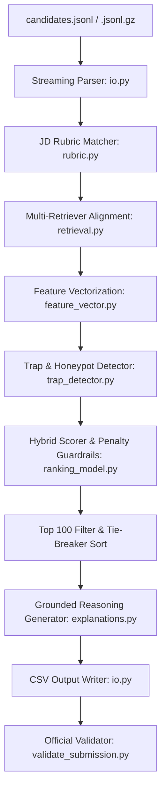

# Redrob Candidate Discovery Challenge Overview

This document provides a comprehensive summary of the Redrob Track 1 Challenge, including design details, constraints, system architecture, directory index, and current implementation progress.

---

## 1. Challenge & Objectives
The goal is to design a high-precision, CPU-only, deterministic candidate ranking system for the founding AI team's **Senior AI Engineer** role at Redrob.

### Key Job Description (JD) Signals
- **Experience:** Preferred range of **5–9 years** (ideally 6–8 years), with flexibility for candidates showing strong adjacent indicators.
- **Expertise:** Production experience shipping embeddings, retrieval systems, hybrid/vector search, and ranking.
- **Evaluation Literacy:** Solid understanding of search benchmarks and evaluation metrics (e.g., NDCG, MRR, MAP, A/B testing).
- **Hiring Logistics:** Candidate availability and recruiter reachability (notice period, response rates, location).
- **Company Alignment:** Preference for product-company trajectories over pure IT services/consulting.

---

## 2. Strict Submission Constraints

| Constraint | Requirement | Status |
| :--- | :--- | :--- |
| **Output Format** | Exactly one UTF-8 encoded `.csv` file. | Configured |
| **Header** | `candidate_id,rank,score,reasoning` | Configured |
| **Count** | Exactly 100 data rows (ranks 1 to 100). | Checked & Validated |
| **Monotonicity** | Scores must be non-increasing as rank increases. | Checked & Validated |
| **Tie-Breaker** | For equal scores, candidates must be sorted by `candidate_id` ascending. | Configured |
| **Compute Limit** | CPU-only, no GPU, no network/LLM API calls. Runtime < 5 mins, Memory < 16 GB RAM. | Validated (Runtime ~20-25s) |
| **Reasoning** | Grounded in profile fields, 1–2 sentences, no hallucinations. | Configured |

---

## 3. System Architecture



### Scoring Logic
```text
base_score = 
    0.19 * title_fit
  + 0.20 * jd_evidence
  + 0.15 * trusted_skills
  + 0.115 * product_company
  + 0.095 * experience_band
  + 0.110 * behavior
  + 0.075 * location
  + 0.035 * retrieval_agreement
  + 0.010 * production_evidence
  + 0.005 * ranking_evaluation
  + 0.005 * skill_assessment
  + 0.010 * hireability

risk_multiplier = 1.0 - min(0.95, combined_risk * 3.0)
final_score = base_score * penalty_multiplier * risk_multiplier
```

---

## 4. Codebase Directory Index

Click on the files below to view their source code:

- **Main Scripts:**
  - [rank.py](file:///E:/redrob/%5BPUB%5D%20India_runs_data_and_ai_challenge/%5BPUB%5D%20India_runs_data_and_ai_challenge/India_runs_data_and_ai_challenge/rank.py) — The CLI entry point for executing the ranking model.
  - [validate_submission.py](file:///E:/redrob/%5BPUB%5D%20India_runs_data_and_ai_challenge/%5BPUB%5D%20India_runs_data_and_ai_challenge/India_runs_data_and_ai_challenge/validate_submission.py) — The official challenge submission validator.
  - [submission_metadata.yaml](file:///E:/redrob/%5BPUB%5D%20India_runs_data_and_ai_challenge/%5BPUB%5D%20India_runs_data_and_ai_challenge/India_runs_data_and_ai_challenge/submission_metadata.yaml) — Project reproducibility metadata.

- **Pipeline Components (`src/redrob_ranker/`):**
  - [cli.py](file:///E:/redrob/%5BPUB%5D%20India_runs_data_and_ai_challenge/%5BPUB%5D%20India_runs_data_and_ai_challenge/India_runs_data_and_ai_challenge/src/redrob_ranker/cli.py) — Argparse command interface.
  - [config.py](file:///E:/redrob/%5BPUB%5D%20India_runs_data_and_ai_challenge/%5BPUB%5D%20India_runs_data_and_ai_challenge/India_runs_data_and_ai_challenge/src/redrob_ranker/config.py) — Global constants and target cities.
  - [explanations.py](file:///E:/redrob/%5BPUB%5D%20India_runs_data_and_ai_challenge/%5BPUB%5D%20India_runs_data_and_ai_challenge/India_runs_data_and_ai_challenge/src/redrob_ranker/explanations.py) — Grounded reasoning template compiler.
  - [features.py](file:///E:/redrob/%5BPUB%5D%20India_runs_data_and_ai_challenge/%5BPUB%5D%20India_runs_data_and_ai_challenge/India_runs_data_and_ai_challenge/src/redrob_ranker/features.py) — Feature scoring and date-parsing primitives.
  - [feature_vector.py](file:///E:/redrob/%5BPUB%5D%20India_runs_data_and_ai_challenge/%5BPUB%5D%20India_runs_data_and_ai_challenge/India_runs_data_and_ai_challenge/src/redrob_ranker/feature_vector.py) — Extracts explicit, auditable [CandidateFeatureVector](file:///E:/redrob/%5BPUB%5D%20India_runs_data_and_ai_challenge/%5BPUB%5D%20India_runs_data_and_ai_challenge/India_runs_data_and_ai_challenge/src/redrob_ranker/feature_vector.py#L35-L63) structures.
  - [io.py](file:///E:/redrob/%5BPUB%5D%20India_runs_data_and_ai_challenge/%5BPUB%5D%20India_runs_data_and_ai_challenge/India_runs_data_and_ai_challenge/src/redrob_ranker/io.py) — Streams JSONL inputs and formats final CSV submissions.
  - [pipeline.py](file:///E:/redrob/%5BPUB%5D%20India_runs_data_and_ai_challenge/%5BPUB%5D%20India_runs_data_and_ai_challenge/India_runs_data_and_ai_challenge/src/redrob_ranker/pipeline.py) — Coordinates candidate loading, ranking, and saving.
  - [profiling.py](file:///E:/redrob/%5BPUB%5D%20India_runs_data_and_ai_challenge/%5BPUB%5D%20India_runs_data_and_ai_challenge/India_runs_data_and_ai_challenge/src/redrob_ranker/profiling.py) — General profiling functionality.
  - [ranking_model.py](file:///E:/redrob/%5BPUB%5D%20India_runs_data_and_ai_challenge/%5BPUB%5D%20India_runs_data_and_ai_challenge/India_runs_data_and_ai_challenge/src/redrob_ranker/ranking_model.py) — Owns the hybrid weighting and penalty formula [score_features](file:///E:/redrob/%5BPUB%5D%20India_runs_data_and_ai_challenge/%5BPUB%5D%20India_runs_data_and_ai_challenge/India_runs_data_and_ai_challenge/src/redrob_ranker/ranking_model.py#L54-L89).
  - [retrieval.py](file:///E:/redrob/%5BPUB%5D%20India_runs_data_and_ai_challenge/%5BPUB%5D%20India_runs_data_and_ai_challenge/India_runs_data_and_ai_challenge/src/redrob_ranker/retrieval.py) — Multi-retriever source detection [retrieval_signals](file:///E:/redrob/%5BPUB%5D%20India_runs_data_and_ai_challenge/%5BPUB%5D%20India_runs_data_and_ai_challenge/India_runs_data_and_ai_challenge/src/redrob_ranker/retrieval.py#L54-L119).
  - [review_loop.py](file:///E:/redrob/%5BPUB%5D%20India_runs_data_and_ai_challenge/%5BPUB%5D%20India_runs_data_and_ai_challenge/India_runs_data_and_ai_challenge/src/redrob_ranker/review_loop.py) — Phase 8 manual label evaluation metrics and NDGC calculator.
  - [rubric.py](file:///E:/redrob/%5BPUB%5D%20India_runs_data_and_ai_challenge/%5BPUB%5D%20India_runs_data_and_ai_challenge/India_runs_data_and_ai_challenge/src/redrob_ranker/rubric.py) — Interprets Must-Haves, Nice-to-Haves, and Negatives from JD.
  - [scoring.py](file:///E:/redrob/%5BPUB%5D%20India_runs_data_and_ai_challenge/%5BPUB%5D%20India_runs_data_and_ai_challenge/India_runs_data_and_ai_challenge/src/redrob_ranker/scoring.py) — Integrates features and ranking model outputs [score_candidate](file:///E:/redrob/%5BPUB%5D%20India_runs_data_and_ai_challenge/%5BPUB%5D%20India_runs_data_and_ai_challenge/India_runs_data_and_ai_challenge/src/redrob_ranker/scoring.py#L11-L39).
  - [trap_detector.py](file:///E:/redrob/%5BPUB%5D%20India_runs_data_and_ai_challenge/%5BPUB%5D%20India_runs_data_and_ai_challenge/India_runs_data_and_ai_challenge/src/redrob_ranker/trap_detector.py) — Phase 7 detector for honeypots and keyword stuffers [detect_traps](file:///E:/redrob/%5BPUB%5D%20India_runs_data_and_ai_challenge/%5BPUB%5D%20India_runs_data_and_ai_challenge/India_runs_data_and_ai_challenge/src/redrob_ranker/trap_detector.py#L48-L151).

---

## 5. Development Progress by Phase

- **Phase 1: Compliance-First Baseline** (Complete)
  - Created a deterministic, CPU-only ranker that outputs exactly 100 rows formatted to specifications.
- **Phase 2: Dataset Intelligence & Submission Auditing** (Complete)
  - Implemented streaming profiling of all candidates to export `risk_examples.csv` and `strong_pool_examples.csv`.
- **Phase 3: Structured JD Rubric & Keyword Alignment** (Complete)
  - Codified Must-Haves, Nice-to-Haves, Negatives, and Logistics in `rubric.py` to drive all down-stream scoring components.
- **Phase 4: Multi-Retriever Candidate Generation** (Complete)
  - Evaluates independent retrieval pathways (AI titles, production evidence, trusted skills) and lifts candidates with high agreement.
- **Phase 5: Explicit Feature Engineering** (Complete)
  - Configured 21 auditable candidate features per candidate to provide explainability.
- **Phase 6: Named Hybrid Ranking Model** (Complete)
  - Configured weights, quality tiers (A, B, C, D), and guardrail penalties for low hireability, services career risk, and title non-fit.
- **Phase 7: Honeypot & Trap Defense Layer** (Complete)
  - Designed explicit detection for unsupported expert claims, impossible skill durations, invalid dates, and curiosity/tutorial keyword stuffing.
- **Phase 8: Human Labeling & Review Calibration Loop** (Complete)
  - Built a separate workbook exporter and evaluated generated labels via NDCG diagnostics to effectively tune the model parameters.
- **Phase 9: Natural Language Explainability** (Complete)
  - Upgraded rule-based logging to grounded, halluncination-free text explanations that outline title, evidence, and risk factors naturally.
- **Phase 10: Evaluation Harness (Pytest)** (Complete)
  - Developed a robust testing suite confirming the 100-row limits, strict determinism, monotonicity, and honeypot guard-rails programmatic properties.
- **Phase 11: Streamlit Demo Sandobox App** (Complete)
  - Assembled an interactive, browser-based UI containing dynamic CSV uploading, ranking execution visuals, and compliance-first downloading outputs.
